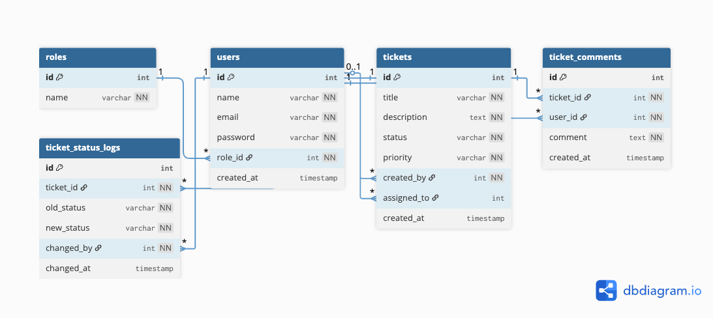

# Support Ticket Management API

This is my backend project for the helpdesk ticket system assignment. Built using ASP.NET Core 8 with PostgreSQL database and JWT for authentication.

## What I Used

- ASP.NET Core 8 Web API
- Entity Framework Core 8 
- PostgreSQL (hosted on Render)
- JWT Bearer tokens for auth
- BCrypt for password hashing
- Swagger UI for testing the API

## What You Need

Make sure you have these installed:
- .NET 8 SDK - download from microsoft website
- PostgreSQL (or use online database like I did)
- dotnet-ef tools for migrations: `dotnet tool install --global dotnet-ef`

## How to Run This Project

**Step 1:** Update database connection (if needed)

Open `appsettings.json` and change the connection string to your database if you're not using the default one provided.

```json
"ConnectionStrings": {
  "DefaultConnection": "Host=localhost;Port=5432;Database=support_tickets;Username=postgres;Password=yourpassword"
}
```

**Step 2:** Run migrations to create tables

```bash
dotnet ef database update
```

This creates all the tables and adds the 3 roles (MANAGER, SUPPORT, USER) automatically.

**Step 3:** Seed the database with test data

Run the provided SQL file to clean the database and insert test users and sample tickets:

```bash
psql -h your-host -p 5432 -U your-user -d your-database -f db_reset_and_seed.sql
```

Or copy the contents of `db_reset_and_seed.sql` and run it in your PostgreSQL client (pgAdmin, DBeaver, etc.)

This will create:
- 6 test users (1 Manager, 2 Support, 3 Regular Users)
- 6 sample tickets with different statuses
- 10 comments across tickets
- Status change logs for audit trail

**Test Credentials:**
- Manager: `manager@example.com` / `manager123`
- Support 1: `support1@example.com` / `support123`
- Support 2: `support2@example.com` / `support123`
- John (USER): `john@example.com` / `user123`
- Jane (USER): `jane@example.com` / `user123`
- Bob (USER): `bob@example.com` / `user123`

**Step 4:** Start the server

```bash
dotnet run
```

The API will start on `http://localhost:5175` (check your terminal for the actual port).

Open Swagger UI at: `http://localhost:5175/docs`

## How to Test the API

1. Go to `/docs` in your browser
2. Login with your manager account using POST /auth/login
3. Copy the token you get back
4. Click the "Authorize" button at the top and paste your token
5. Now you can test all endpoints!

Create users with POST /users, create tickets with POST /tickets, etc.

## User Roles & Permissions

**MANAGER** - Can do everything
- Create tickets ✓
- See all tickets ✓
- Assign tickets to support ✓
- Change ticket status ✓
- Delete tickets ✓

**SUPPORT** - Handles assigned tickets
- Create tickets ✗
- See only assigned tickets ✓
- Assign tickets ✓
- Change status ✓
- Delete tickets ✗

**USER** - Regular employees
- Create tickets ✓
- See own tickets only ✓
- Cannot assign ✗
- Cannot change status ✗
- Cannot delete ✗

## Important: Ticket Status Flow

Tickets MUST follow this exact order, you can't skip steps:

```
OPEN → IN_PROGRESS → RESOLVED → CLOSED
```

If you try to skip (like OPEN → RESOLVED) or go backwards, you'll get a 400 error.

## API Response Codes

- 200 = Success
- 201 = Created something new
- 204 = Deleted successfully (no response body)
- 400 = Bad request or validation failed
- 401 = Not logged in or invalid token
- 403 = You don't have permission
- 404 = Not found

## Project Structure

```
Controllers/
  - AuthController.cs (login)
  - UsersController.cs (create/list users)
  - TicketsController.cs (ticket CRUD + assign + status)
  - CommentsController.cs (add/edit/delete comments)

Models/
  - User, Role, Ticket, TicketComment, TicketStatusLog

DTOs/
  - All the request/response data transfer objects

Data/
  - AppDbContext.cs (EF Core setup)
```

## Database Schema

The database has 5 tables with proper relationships:

1. **roles** - MANAGER, SUPPORT, USER
2. **users** - User accounts linked to roles
3. **tickets** - Support tickets with status and priority
4. **ticket_comments** - Comments on tickets
5. **ticket_status_logs** - Logs every status change



Relationships are set up so deleting a ticket automatically deletes its comments and logs (cascade delete).

## Notes

- All passwords are hashed with bcrypt, never stored as plain text
- JWT tokens expire after 8 hours
- Status changes are logged in ticket_status_logs table
- Deleting a ticket cascades to delete its comments and logs
- You can't assign tickets to users with USER role (only MANAGER/SUPPORT)

## Endpoints

**Auth:**
- `POST /auth/login` - Login and get JWT token

**Users (MANAGER only):**
- `POST /users` - Create new user
- `GET /users` - List all users

**Tickets:**
- `POST /tickets` - Create ticket (USER, MANAGER)
- `GET /tickets` - Get tickets (filtered by role)
- `PATCH /tickets/{id}/assign` - Assign to support (MANAGER, SUPPORT)
- `PATCH /tickets/{id}/status` - Update status (MANAGER, SUPPORT)
- `DELETE /tickets/{id}` - Delete ticket (MANAGER only)

**Comments:**
- `POST /tickets/{id}/comments` - Add comment
- `GET /tickets/{id}/comments` - Get all comments
- `PATCH /comments/{id}` - Edit comment (author or MANAGER)
- `DELETE /comments/{id}` - Delete comment (author or MANAGER)

## Validation Rules

- Ticket title must be at least 5 characters
- Ticket description must be at least 10 characters
- Priority must be LOW, MEDIUM, or HIGH
- Status must follow the linear progression (can't skip)
- Email format must be valid

---

*This project demonstrates a complete RESTful API with proper authentication, authorization, and business logic enforcement. All requirements from the specification have been implemented and tested.*
